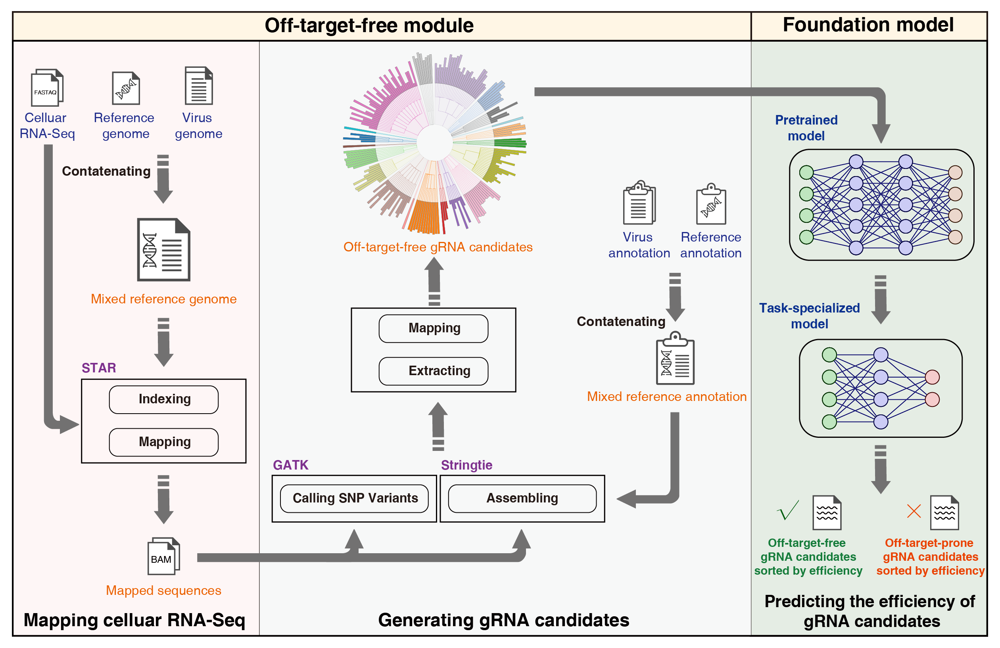

# CRISPR-viva

## Introduction
CRISPR-viva is a a universal and host cell context-aware guide RNA design framework for CRISPR-based RNA virus detection and inhibition facilitated by a foundation model.

CRISPR-viva is designed as a universal foundation model-driven framework to generate optimized guide RNA candidates that are targeted to the virus in a highly sensitive and specific way by considering the personalized host cell transcriptome and avoiding targeting the endogenous transcriptome of the treated cell. Thus, this framework can seamlessly adapt to virus detection and inhibition scenarios with cell types, RNA virus and rapidly evolving CRISPR systems. 

CRISPR-viva consists of two modules, the off-target-free module and the foundation model module (Figure). With the guide RNA candidates generated via the screening process of both modules, a package of high-efficacy guide RNAs for virus detection and inhibition with respect to designated CRISPR system can be obtained.




## Requirement
* python == 3.11
* fastq-dump
* samtools
* gffread
* STAR == 2.7.10b
* stringtie == 2.1.7
* GATK == v4.3.0.0
* vcftools == 0.1.16
* bowtie2 == 2.5.2
* pyfaidx == 0.8.1.1
* pytorch >= 2.3
* dask == 2024.5.0
* transformers == 4.29.2
* datasets == 2.19.1

Because of the difficulty of installing the abovementioned software and packages, we highly recommand using our docker image.

## Docker image (Highly recommand!)
1. Download from [Huggingface repo](https://huggingface.co/bm2-lab/CRISPR-viva/resolve/main/docker-image/crispr-viva.tar.gz?download=true)
2. Decompress the tar.gz file to tar file, then use the following command:
```bash
docker load --input crispr-viva.tar
```
Note:
1. Using the command above to attain crispr-viva image;
2. This image already contains all requirements above. 

## Usage
1. Generate off-target-free guide RNA candidates for RNA virus detection and inhibition task with given cell line, RNA virus and CRISPR system. We have provided field-deployable guide RNA candidates in our [CRISPR-viva platform](https://www.crisprviva.top/).

```
usage: python crisprviva.py <command> [options]

options:
  -h, --help  show this help message and exit

Command:
  
    ref       Building reference
    expr      RNA Expression profile analysis
    elim      gRNA generation for viral elimination
    det       gRNA generation for viral detection
    util      Utilities
```

2. Load models from [our huggingface model repo](https://huggingface.co/bm2-lab/CRISPR-viva).
3. Perform prediction.


## Citation


## Contacts
18alexanderm117@tongji.edu.cn or qiliu@tongji.edu.cn
